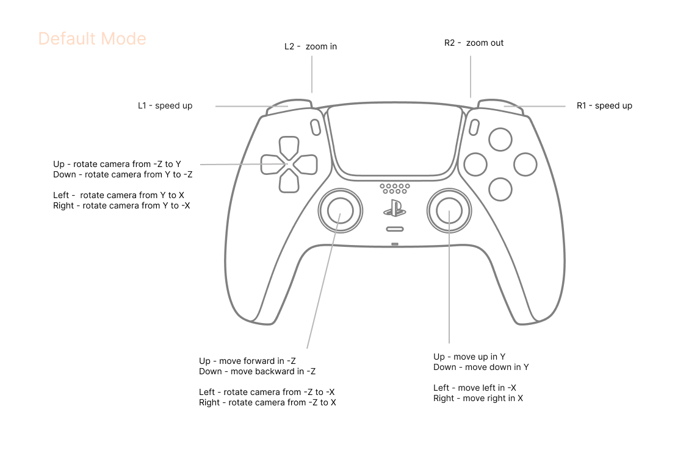

## WebGPU SDF example

Live demo https://r.tiye.me/Triadica/soluble/ .

### 开发与部署

使用 Calcit 0.27.0、Node.js 24 和 Yarn 4.18.0。运行 `caps --strict --ci`、
`yarn install --immutable` 后，`yarn dev` 启动页面；另一个终端运行
`yarn watch` 监听 Calcit 源码。`yarn build` 编译 Calcit、TypeScript 和前端资源。
Calcit 源码与依赖分别保存在 `calcit.cirru`、`deps.cirru`；`js-out/`、`lib/` 和
`dist/` 都是忽略的生成目录，不提交到仓库。

生产构建使用 `VITE_BASE_URL=https://cos-sh.tiye.me/WebGPU-Art/soluble/`。
仅前端 `dist/` 上传 COS，上传 action 的 `public-base-url` 负责内容校验，
没有独立 CDN 校验脚本。原 rsync 服务器路径保持不变。PR 只检查和构建，不部署。
生产任务串行且不中途取消：开始上传前检查 main revision；开始后完成同一 revision
的 COS 和服务器部署，新提交排队处理。这不是与 main 原子同步的保证。

TypeScript/WGSL 渲染层、原图片资源 URL 和手柄行为不因 CDN 前缀配置而改变。

TypeScript 6.0.3 自带 DOM 的 WebGPU 声明尚不完整，按
[WebGPU 类型上游建议](https://github.com/gpuweb/types)使用 `@types/web` 提供完整 DOM
类型，不同时加载 `@webgpu/types`，也不关闭库类型检查。

Params:

- `interval=30` to set rendering interval
- `mode=dev` for logs
- `threshold=0.2` to set value threshold of gamepad axes
- `tab=stars` for default open tab, for example `stars`
- `hide-tabs=true` for hiding nav tab

Resources:

- reused code from https://github.com/Triadica/sapium and lagopus,
- shapes https://gist.github.com/munrocket/f247155fc22ecb8edf974d905c677de1

### Bind Groups

Compute shader:

```wgsl
@group(0) @binding(0) var<uniform> uniforms: UniformsData;
@group(0) @binding(1) var<uniform> params: Params;


@group(1) @binding(0) var<storage, read_write> base_points: array<BaseCell>;
```

Vertex shader:

```wgsl
@group(0) @binding(0) var<uniform> uniforms: UniformsData;
@group(0) @binding(1) var<uniform> params: Params;

@group(1) @binding(0) var<storage, read_write> base_points: array<BaseCell>;

@group(2) @binding(0) var mySampler : sampler;
@group(2) @binding(1) var myTexture : texture_2d<f32>; // optionally more
```

### Imports

```wgsl
#import soluble::perspective
#import soluble::math
#import soluble::mirror
```

### Gamepad Controls



### License

MIT
